# Market Intel Brain - Enterprise Architecture Documentation

## 📋 **Table of Contents**

1. [Overview](#overview)
2. [System Architecture](#system-architecture)
3. [Data Flow Architecture](#data-flow-architecture)
4. [Security Architecture](#security-architecture)
5. [Microservices Architecture](#microservices-architecture)
6. [Communication Patterns](#communication-patterns)
7. [Error Handling Strategy](#error-handling-strategy)
8. [Observability Architecture](#observability-architecture)
9. [Deployment Architecture](#deployment-architecture)
10. [Performance Characteristics](#performance-characteristics)

---

## 🎯 **Overview**

The Market Intel Brain is a high-performance, enterprise-grade microservices system designed for real-time market intelligence and predictive analytics. The system processes millions of market data points per second with sub-millisecond latency while maintaining 99.9% availability.

### **Key Characteristics**
- **Language Stack**: Go (API Gateway) + Rust (Core Engine) + Python (Analytics)
- **Communication**: gRPC with mTLS security
- **Data Processing**: LMAX Disruptor pattern for high throughput
- **Storage**: PostgreSQL + Redis + Vector Database (Qdrant)
- **Messaging**: Apache Kafka for real-time streaming
- **Observability**: OpenTelemetry + Prometheus + Grafana + Jaeger

---

## 🏗️ **System Architecture**

### **High-Level Architecture**

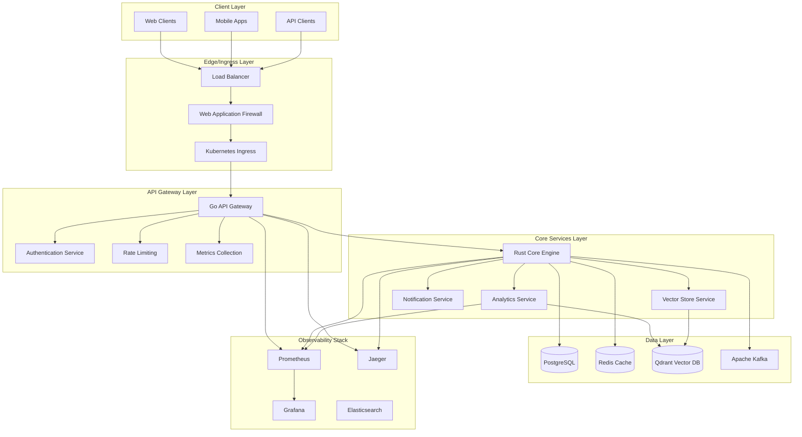

### **Service Mesh Architecture**

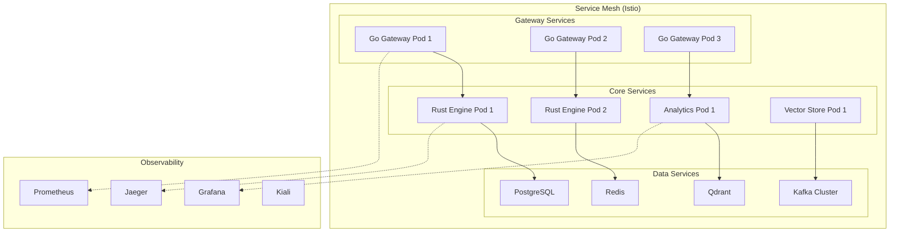

---

## 🌊 **Data Flow Architecture**

### **HTTP Request to Database Flow**

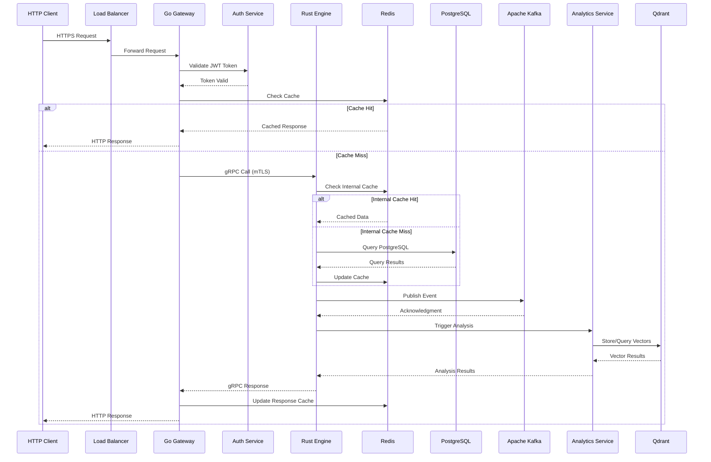

### **Real-time Data Processing Flow**

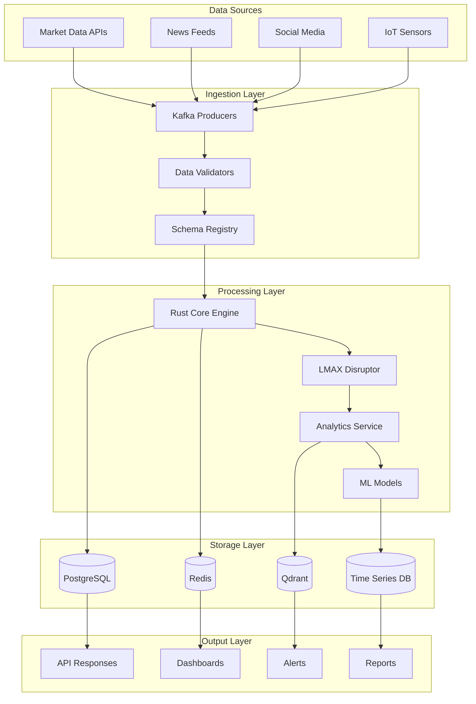

---

## 🔒 **Security Architecture**

### **mTLS Security Boundaries**

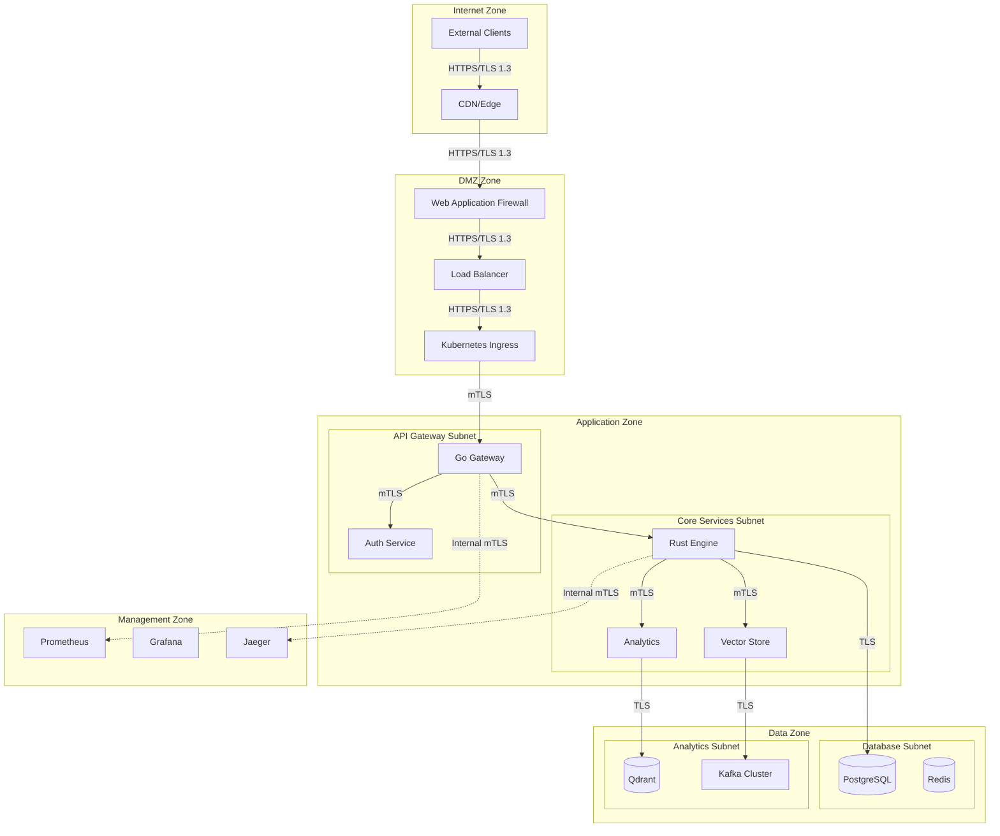

### **Security Layers**

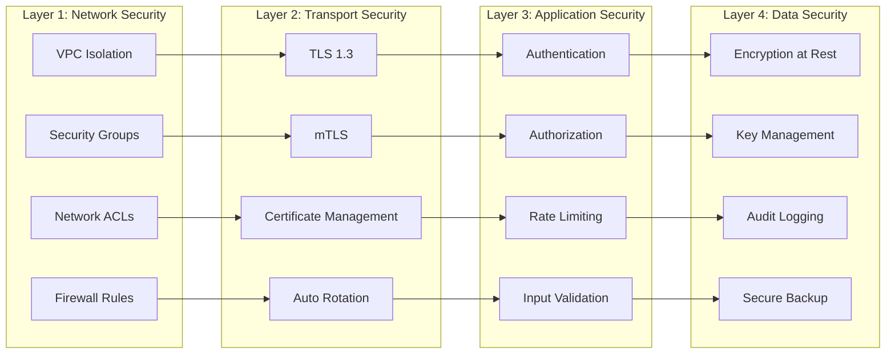

---

## 🔧 **Microservices Architecture**

### **Service Communication Patterns**

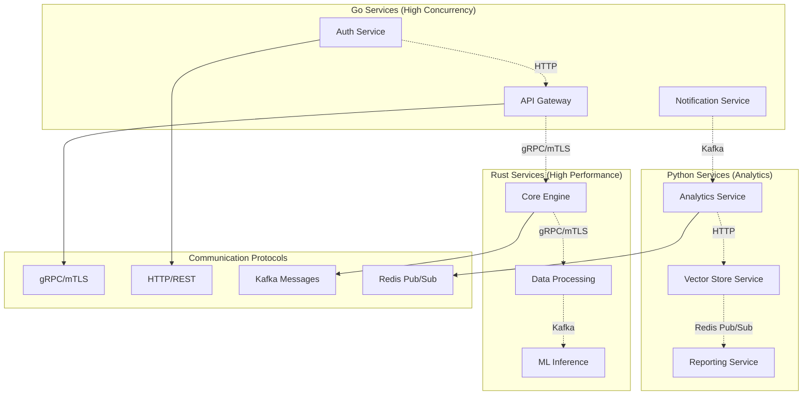

### **Service Dependencies**

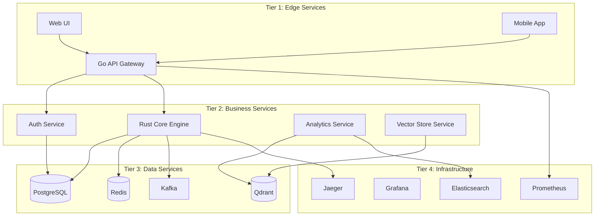

---

## 🔄 **Communication Patterns**

### **Synchronous Communication**

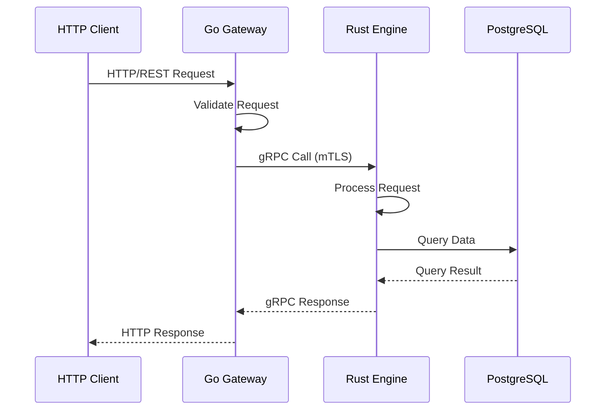

### **Asynchronous Communication**

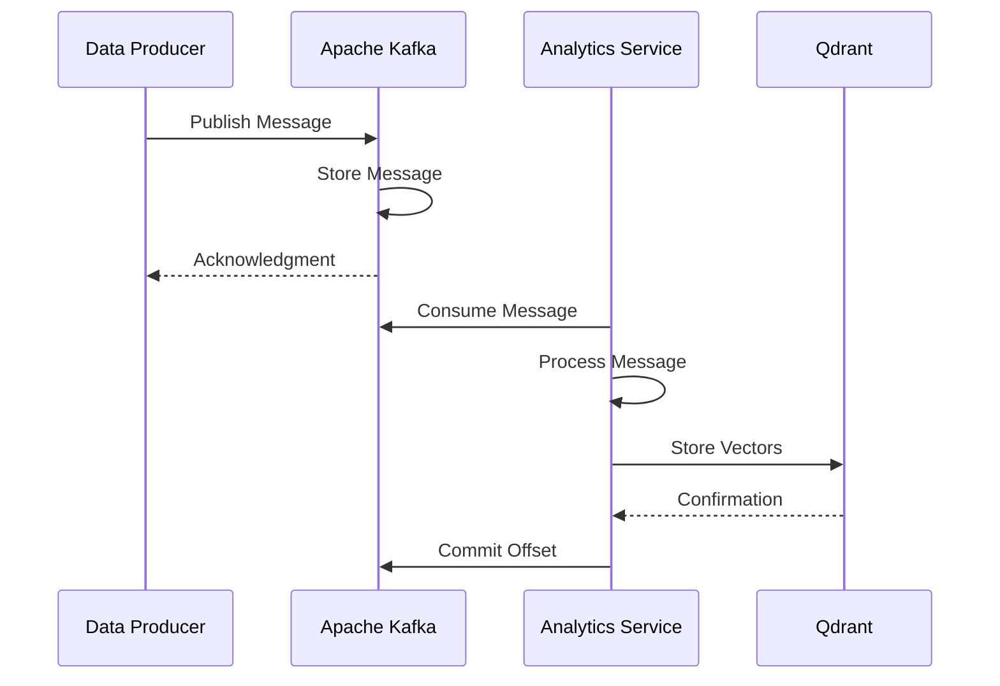

### **Event-Driven Architecture**

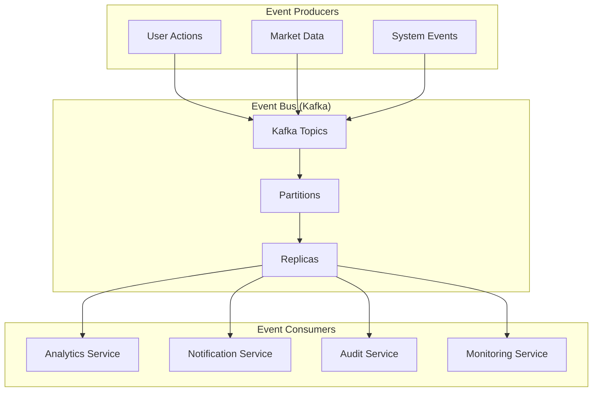

---

## ⚠️ **Error Handling Strategy**

### **Rust Result/Option Pattern Usage**

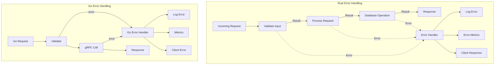

### **Error Propagation Flow**

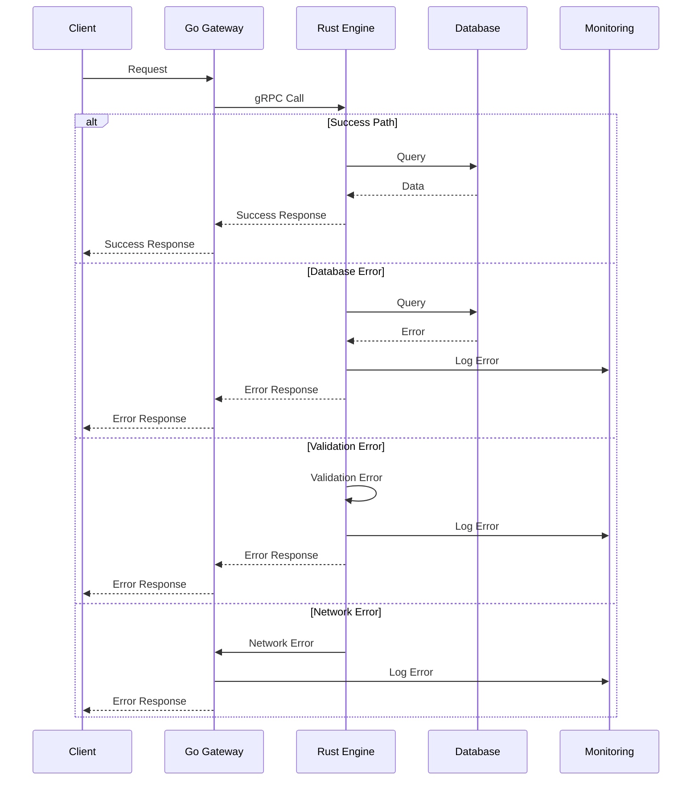

### **Circuit Breaker Pattern**

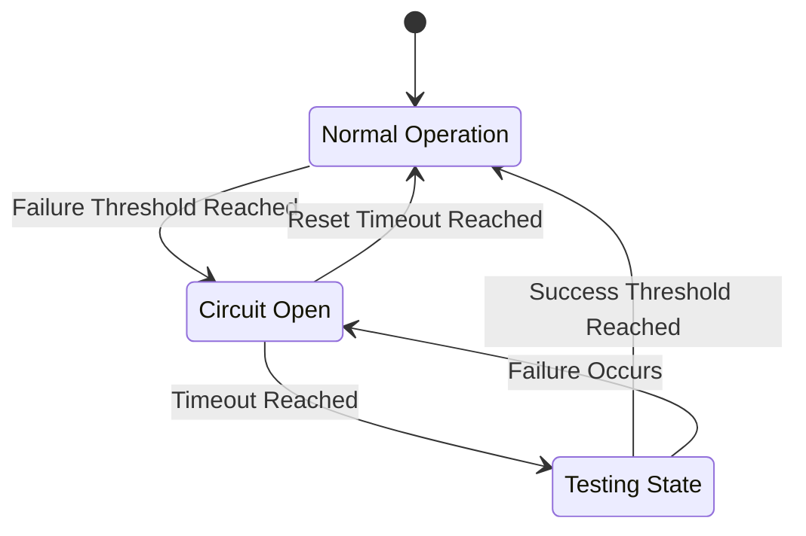

---

## 📊 **Observability Architecture**

### **Distributed Tracing**

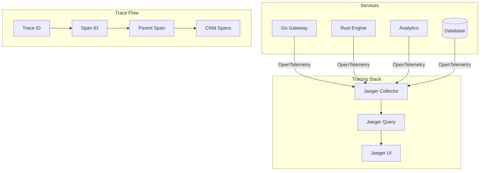

### **Metrics Collection**

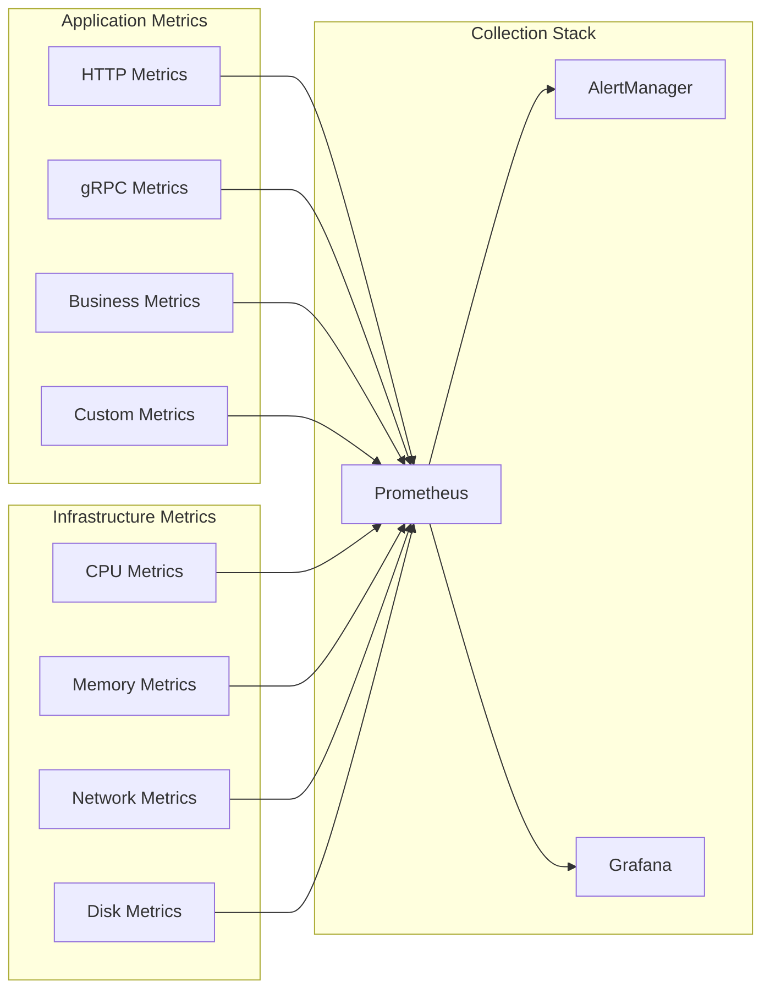

---

## 🚀 **Deployment Architecture**

### **Kubernetes Deployment**

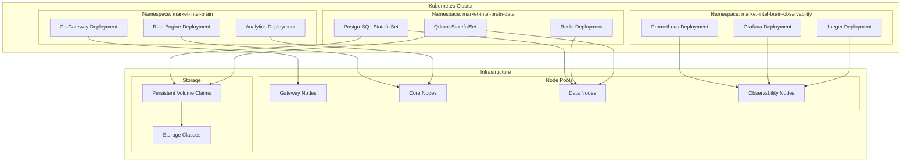

### **CI/CD Pipeline**

```mermaid
graph LR
    subgraph "Development"
        CODE[Code Changes]
        UNIT_TESTS[Unit Tests]
        INTEGRATION_TESTS[Integration Tests]
    end
    
    subgraph "CI Pipeline"
        BUILD[Build Docker Images]
        SECURITY_SCAN[Security Scanning]
        QUALITY_GATES[Quality Gates]
        ARTIFACT_REGISTRY[Artifact Registry]
    end
    
    subgraph "CD Pipeline"
        DEV_DEPLOY[Dev Deployment]
        STAGING_DEPLOY[Staging Deployment]
        PRODUCTION_DEPLOY[Production Deployment]
    end
    
    CODE --> UNIT_TESTS
    UNIT_TESTS --> INTEGRATION_TESTS
    INTEGRATION_TESTS --> BUILD
    
    BUILD --> SECURITY_SCAN
    SECURITY_SCAN --> QUALITY_GATES
    QUALITY_GATES --> ARTIFACT_REGISTRY
    
    ARTIFACT_REGISTRY --> DEV_DEPLOY
    DEV_DEPLOY --> STAGING_DEPLOY
    STAGING_DEPLOY --> PRODUCTION_DEPLOY
```

---

## ⚡ **Performance Characteristics**

### **Throughput and Latency**

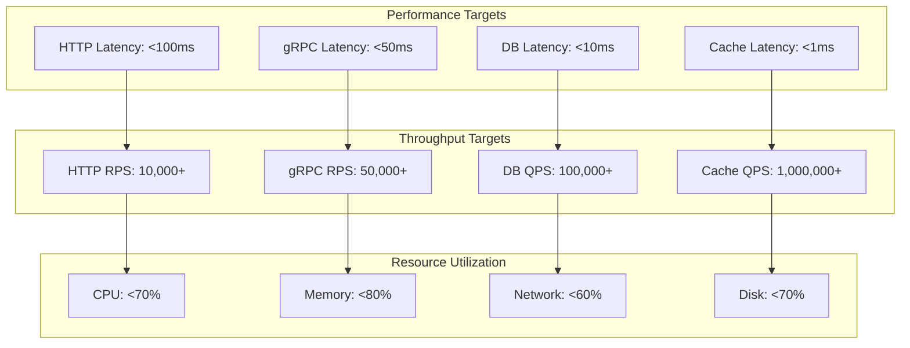

### **Scaling Characteristics**

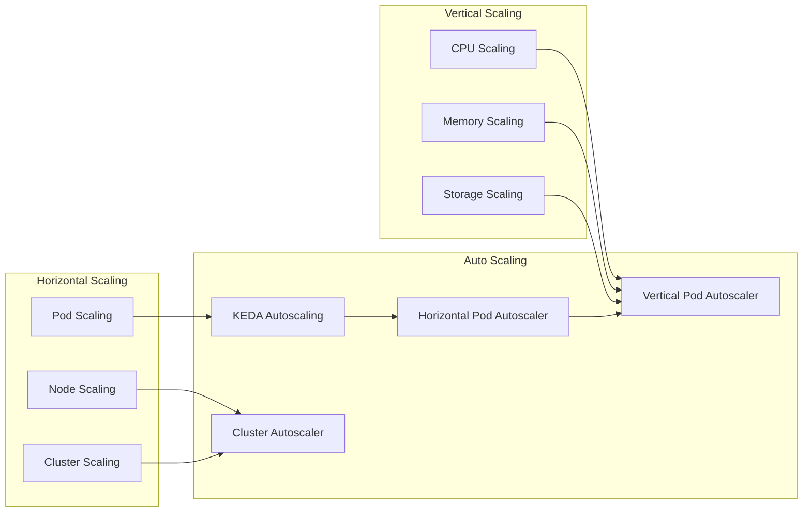

---

## 📚 **Architecture Principles**

### **Design Principles**

1. **High Performance**: Sub-millisecond latency for critical paths
2. **High Availability**: 99.9% uptime with graceful degradation
3. **Security First**: Zero-trust architecture with mTLS everywhere
4. **Observability**: Complete observability across all services
5. **Scalability**: Horizontal and vertical scaling capabilities
6. **Resilience**: Circuit breakers, retries, and fallback mechanisms
7. **Simplicity**: Clean, maintainable, and well-documented code

### **Technology Choices**

| Component | Technology | Rationale |
|-----------|------------|-----------|
| API Gateway | Go | High concurrency, excellent HTTP performance |
| Core Engine | Rust | Maximum performance, memory safety |
| Analytics | Python | Rich ML/AI ecosystem |
| Communication | gRPC | High performance, type-safe, streaming |
| Security | mTLS | End-to-end encryption, mutual authentication |
| Messaging | Kafka | High throughput, durable streaming |
| Caching | Redis | Sub-millisecond latency, rich data structures |
| Vector DB | Qdrant | AI/ML optimized vector operations |
| Observability | OpenTelemetry | Vendor-neutral, comprehensive |

---

## 🔮 **Future Architecture Evolution**

### **Planned Enhancements**

1. **Service Mesh**: Full Istio implementation for advanced traffic management
2. **Event Sourcing**: CQRS pattern with event sourcing for audit trails
3. **Multi-Region**: Geo-distributed deployment for global availability
4. **Edge Computing**: Edge processing for reduced latency
5. **AI/ML Pipeline**: Enhanced ML pipeline with model versioning
6. **Blockchain**: Immutable audit trails for compliance

### **Technology Roadmap**

```mermaid
timeline
    title Architecture Evolution Roadmap
    
    section Q1 2024
        Service Mesh Implementation
        Advanced Observability
        Performance Optimization
    
    section Q2 2024
        Event Sourcing
        Multi-Region Deployment
        Enhanced Security
    
    section Q3 2024
        AI/ML Pipeline
        Edge Computing
        Blockchain Integration
    
    section Q4 2024
        Full Automation
        Advanced Analytics
        Global Scale
```

---

## 📖 **Conclusion**

The Market Intel Brain architecture represents a modern, cloud-native approach to building high-performance, scalable, and secure microservices systems. The combination of Go, Rust, and Python provides the right balance of performance, safety, and productivity, while the comprehensive observability and security layers ensure enterprise-grade reliability and compliance.

The architecture is designed to handle massive scale while maintaining sub-millisecond latency, making it suitable for real-time market intelligence applications where performance and reliability are critical.

---

*This documentation is continuously updated as the system evolves. For the latest information, please refer to the GitHub repository and internal documentation.*
