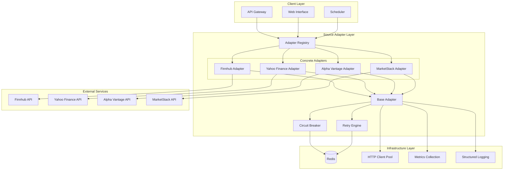

# MAIFA Source Adapter Layer Architecture

## Component Overview

### **Core Interfaces & Contracts**
- **Error Contract**: Unified exception hierarchy with transient/non-transient classification
- **Circuit Breaker**: Redis-based distributed circuit breaker for multi-node environments
- **Retry Engine**: Exponential backoff with jitter and exception filtering

### **Base Layer & Validation**
- **Base Adapter**: Abstract class with HTTP client pooling and fingerprint-safe headers
- **Request Schemas**: Pydantic V2 models for strict type validation
- **Response Schemas**: Unified normalization models for consistent data format

### **Concrete Implementation & Orchestration**
- **Finnhub Adapter**: Canonical implementation demonstrating all patterns
- **Adapter Registry**: Factory pattern for dynamic, lazy-loading of adapters

### **Key Features**
- **Zero-Crash Design**: All exceptions wrapped and handled gracefully
- **Fingerprint Safety**: Dynamic User-Agent rotation and header management
- **Connection Pooling**: HTTPX client with optimized connection reuse
- **Distributed Resilience**: Redis-backed circuit breaker and retry logic
- **Strict Typing**: Python 3.12+ with comprehensive type hints
- **Observability**: Structured logging and metrics collection
- **Dependency Injection**: Testable design with mock support
